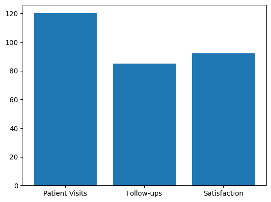

# Healthcare KPI Analysis

This project demonstrates my ability to analyze healthcare operational data and visualize key performance indicators (KPIs) to support data-driven decision-making. The analysis focuses on metrics that influence patient outcomes, operational efficiency, and revenue performance — skills directly relevant to a Junior Data Analyst role at Calibrate.

## Key Highlights

- **Patient Visits & Follow-ups:** Evaluated engagement trends to optimize scheduling and care delivery.  
- **Satisfaction:** Measured client satisfaction scores to identify opportunities for improvement.  
- **Revenue & Retention:** Monitored financial performance and member retention to support business strategy.

## KPI Chart

The chart below presents a concise visual summary of the main KPIs:

*Interpretation:* The chart highlights which areas are performing well and which require attention, providing actionable insights to guide operational and clinical decisions.

## Skills Demonstrated

- Data cleaning and manipulation using **pandas** in Python.  
- Data visualization with **matplotlib**, producing clear and concise charts.  
- Communicating insights effectively for cross-functional stakeholders.  
- Preparing portfolio-ready materials suitable for professional review.

---

*This project demonstrates my ability to turn raw data into actionable insights, aligning with Calibrate’s mission to improve metabolic health outcomes using data-driven decisions.*